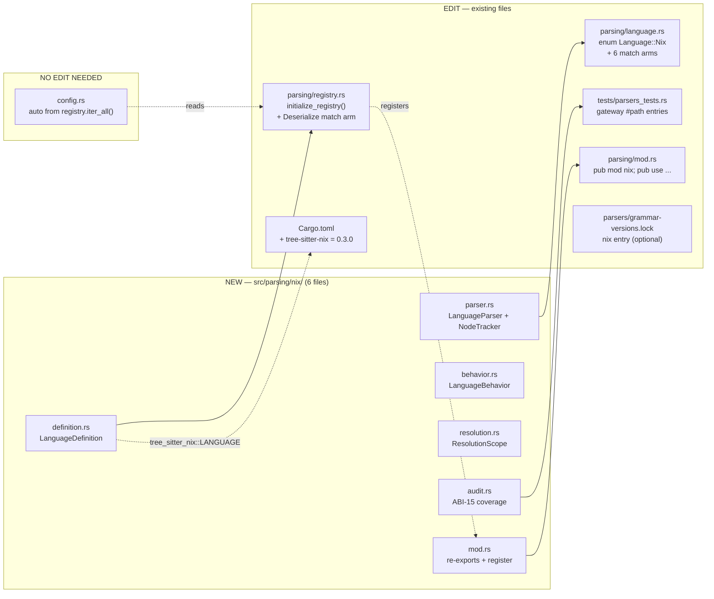
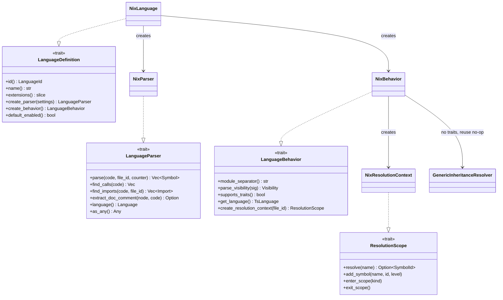
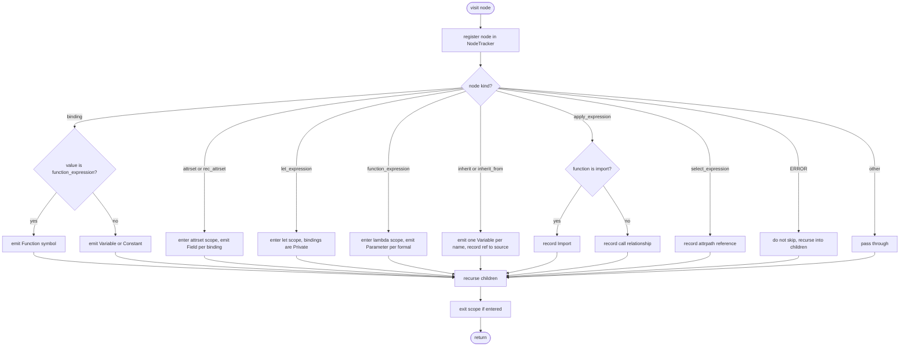
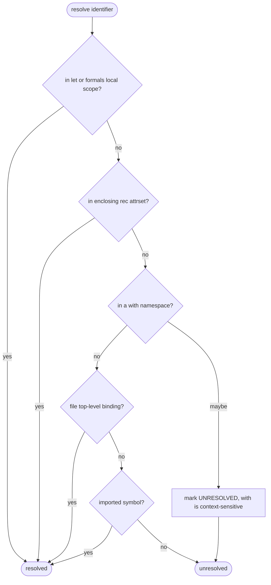
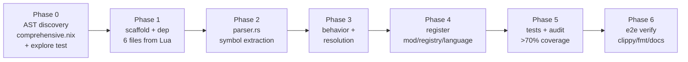

# Nix Language Parser — Implementation Plan

> Status: **planning** · Branch: `feature/parser-for-nix-lang` · Target grammar: `tree-sitter-nix 0.3.0`
>
> This document is the execution plan for adding Nix expression-language support to
> codanna. It follows the conventions in
> [`contributing/development/language-support.md`](../../development/language-support.md)
> and uses **Lua** as the closest reference parser (dynamic, no traits, attrset/scope-centric).

---

## 1. Compatibility verdict

| Item | Value |
|---|---|
| Grammar crate | `tree-sitter-nix = "0.3.0"` (nix-community, Jul 2025) |
| Binding style | modern `LANGUAGE: tree_sitter_language::LanguageFn` (ABI-14/15) |
| Core dep | `tree-sitter-language = "0.1.0"` (no direct `tree-sitter` dep) |
| codanna core | `tree-sitter 0.26.9` — **compatible** |
| Wiring | identical to Lua: `tree_sitter_nix::LANGUAGE.into()` → `parser.set_language(&lang)` |

No version conflict: the grammar exposes the same `LanguageFn` constant codanna already
consumes for Lua/Clojure/etc.

---

## 2. Module + wiring map

Six **new** files in `src/parsing/nix/` plus a small set of **existing** files to edit.
`config.rs` is intentionally NOT edited — `generate_language_defaults()` auto-populates from
the registry.



> `language.rs` is **required**, not optional: `Language::from_extension` calls
> `from_language_id("nix")`; without the `Nix` arm it returns `None` and `.nix` files are
> never detected.

---

## 3. Trait architecture

The four traits each new file implements, and the shared types they touch.



---

## 4. Nix → codanna symbol mapping

Node names use the `_expression` suffix convention of tree-sitter-nix and **must be confirmed
in Phase 0** (AST discovery).

| Nix construct | tree-sitter-nix node (confirm) | SymbolKind | Notes |
|---|---|---|---|
| `.nix` file | root (`source_code`) | Module | file-based path, separator `.` |
| binding whose value is a lambda | `binding` + `function_expression` | **Function** | key heuristic |
| binding with non-lambda value | `binding` | Variable / Constant | literal RHS → Constant |
| returned attrset keys | `attrset_expression` → `binding` | Field | Public |
| `rec { ... }` attrs | `rec_attrset_expression` | Field | self-referential scope |
| lambda params `{ a, b ? d, ... }:` | `formals` / `formal` | Parameter | `@`-pattern binds whole set |
| `inherit a;` / `inherit (src) a;` | `inherit` / `inherit_from` | Variable (+ref to src) | one node → many bindings |
| `import ./x.nix`, `<nixpkgs>` | `apply_expression` + `path_expression` / `spath_expression` | Import | dynamic interpolation = best-effort |
| `f x`, `callPackage ./p.nix {}` | `apply_expression` | call relationship | resolve `function` field |
| `a.b.c` | `select_expression` + `attrpath` | reference | def-vs-ref by position |

**Visibility:** no keywords → `let`/`formals` = `Private`; returned attrset attrs = `Public`.
**Traits/inheritance:** none → `supports_traits() = false`, reuse `GenericInheritanceResolver`.

---

## 5. Parser traversal logic

`extract_symbols_from_node` decision flow (every visited node is registered with `NodeTracker`
to drive the audit report).



---

## 6. Scope resolution order



> `with expr;` cannot be resolved statically (its bindings depend on a runtime value, and it
> never shadows other bindings). Treat such references as unresolved — a documented limitation,
> same class codanna already tolerates for dynamic dispatch.

---

## 7. Execution phases



All commands run in the flake (`nix develop -c ...`).

### Phase 0 — AST node discovery (do first; do not guess node names)
- Write `examples/nix/comprehensive.nix` covering: lambdas, `let`, `rec`, `inherit` /
  `inherit (x)`, `with`, `if`, `assert`, attrsets, lists, `import`, `<nixpkgs>`, string
  interpolation, paths, `a.b.c`, `@`-patterns, defaults, `...`.
- Add a throwaway `explore_nix_abi15` test that loads `tree_sitter_nix::LANGUAGE`, parses it,
  and prints `node.kind()` + `kind_id()` (reuse `discover_nodes` from `lua/audit.rs`).
  `nix develop -c cargo test explore_nix_abi15 -- --nocapture`
- Record findings → `contributing/parsers/nix/NODE_MAPPING.md` + `node-types.json`.
- Alternative: add `pkgs.tree-sitter` + `pkgs.nodejs` to the flake devShell and use
  `contributing/tree-sitter/scripts/`.

### Phase 1 — Scaffold + dependency
- `Cargo.toml` += `tree-sitter-nix = "0.3.0"` (after the `tree-sitter-clojure-orchard` line).
- `mkdir src/parsing/nix`, copy the six `lua/*.rs` files as skeletons, rename
  `Lua`→`Nix`, `tree_sitter_lua`→`tree_sitter_nix`.
- Implement order: `definition.rs` → `parser.rs` → `behavior.rs` → `resolution.rs` →
  `audit.rs` → `mod.rs`.

### Phase 2 — parser.rs
- `extract_symbols_from_node` per the traversal diagram. Minimum methods: `parse`,
  `find_calls`, `find_imports`, `extract_doc_comment`, `as_any`, `language()` → `Language::Nix`.
- Register every node in `NodeTracker`. Handle `ERROR` by recursing. Zero-copy slices.

### Phase 3 — behavior.rs + resolution.rs
- behavior: `module_separator() = "."`, file-based `module_path_from_file`,
  `parse_visibility` (Public default), `supports_traits() = false`,
  `get_language()` = `tree_sitter_nix::LANGUAGE.into()`.
- resolution: `NixResolutionContext` with the scope order above; `with` → unresolved.

### Phase 4 — registration
- `src/parsing/mod.rs`: `pub mod nix;` + `pub use nix::{NixBehavior, NixParser};`
- `src/parsing/registry.rs`: `super::nix::register(registry);` in `initialize_registry()`,
  and `"nix" => "nix",` in the `Deserialize` match.
- `src/parsing/language.rs`: `Nix` variant + arms in `to_language_id`, `from_language_id`,
  `from_extension` fallback, `extensions`, `config_key`, `name` (extension `"nix"`).
- Decide `default_enabled()` — **recommend `false` during dev, flip to `true` at release**.

### Phase 5 — tests + audit
- `audit.rs` (copy Lua, swap key-node list).
- `tests/parsers/nix/` + gateway `#[path = "parsers/nix/..."]` in `tests/parsers_tests.rs`.
- `nix develop -c cargo test nix`
- `nix develop -c cargo test audit_nix -- --nocapture`  (target >70% key-node coverage)

### Phase 6 — end-to-end verify + polish
```
nix develop -c cargo build
nix develop -c cargo clippy --fix
nix develop -c cargo fmt
nix develop -c bash -c 'cargo run -- init && cargo run -- index . && cargo run -- retrieve search "mkDerivation"'
```
- Update supported-list in `language-support.md` and add the `nix` entry to
  `grammar-versions.lock`.

---

## 8. Risks & open decisions

| Item | Disposition |
|---|---|
| `with expr;` scoping | statically unresolvable → documented limitation, do not block |
| string/path interpolation `${...}` | extract inner identifier as ref; dynamic target best-effort |
| `attrpath` def vs ref | disambiguate by binding (LHS) vs expression (RHS) position |
| flake lacks `tree-sitter` CLI | use Rust exploration test (Phase 0), or add `tree-sitter`+`nodejs` to flake |
| `default_enabled` true/false at merge | **open** — recommend `false` until audit coverage is solid |

---

## 9. Touch-point checklist

- [ ] `Cargo.toml` — `tree-sitter-nix = "0.3.0"`
- [ ] `src/parsing/nix/{mod,definition,parser,behavior,resolution,audit}.rs`
- [ ] `src/parsing/mod.rs` — module + re-export
- [ ] `src/parsing/registry.rs` — `initialize_registry()` + `Deserialize` arm
- [ ] `src/parsing/language.rs` — `Language::Nix` + 6 match arms
- [ ] `examples/nix/comprehensive.nix` (+ `main.nix`)
- [ ] `tests/parsers/nix/` + `tests/parsers_tests.rs` gateway
- [ ] `contributing/parsers/nix/NODE_MAPPING.md` + `node-types.json`
- [ ] `contributing/parsers/grammar-versions.lock` — nix entry
- [ ] `config.rs` — **no edit** (auto from registry)
